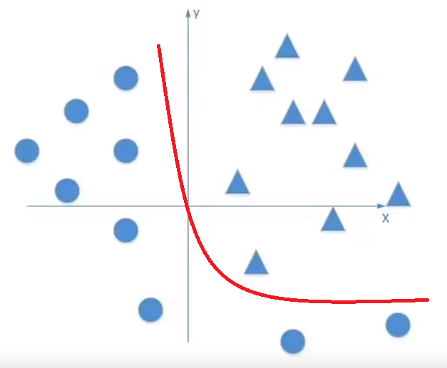
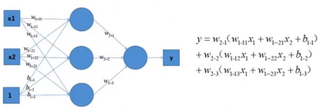
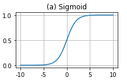
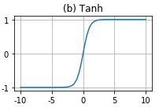
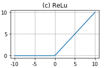
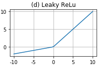

### Activation 介紹
- 原理 
解決線性模型所不能解決的非線性問題，我們有一組數據，理想的紅線可以區分開這兩類 
 
使用複雜的多感知器組合網路，泰勒展開後依然逃不開線性相依的問題也就做不出上面紅色的劃分線 
 
根據上圖得到 
1. 線性相依問題
2. 需要計算輸出與輸入誤差，更新權重，如果輸入過大，輸出也會過大，更新出來的權重就無意義
3. 反向傳播(back propagation)問題

- 常見的激活函數
Sigmoid 
 
求導容易，計算簡單，但反向傳播時(求導數)，過深層的網路會有嚴重梯度消失的問題，計算量大(指數運算) 。 
梯度消失，具體原因Sigmoid and Tanh 接近飽和區求導後取近於0 造成更新的訊息無法解由反向傳播傳遞。 

Tanh 
 
如同兩倍的Sigmoid ，且梯度消失比Sigmoid小，一樣計算量大(指數運算) 。 

ReLU 
 
大於0 取本身，小於0 都是0，減少參數相關性減少過擬合，計算量小，梯度下降收斂快於Sigmoid and Tanh。 
缺點 神經元被設定為0 後，就永遠無法被激活了，尤其learning rate 又很大時更容易使小於0的神經元失去表達能力。 

Leaky ReLU or RReLU 
 
加入小於0 的方程式參數，解決ReLU 小於0 產生的問題，而RReLU 的參數由訓練得到  

##### Reference
- [1] https://zhuanlan.zhihu.com/p/32824193
