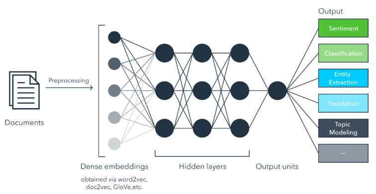

### Dense 介紹
- 原理 
Denase (fully connected)是深度學習中最基本的神經元網路，所有的輸入輸出都接於該層中的所有神經元，當Dense 作為第一層時，需指定input shape。
 

##### Reference
- [1] https://www.jianshu.com/p/86d667ee3c62
- [2] https://www.iflexion.com/blog/extracting-meaning-convergence-machine-learning-text-analysis/
