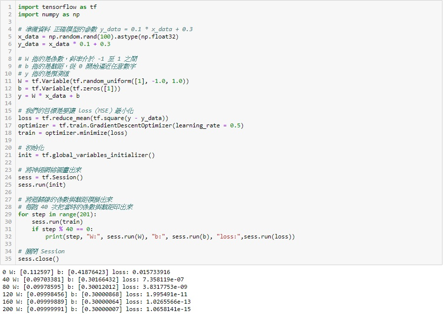

### Gradient descent 介紹
- 實驗 
找出已知迴歸模型（y = 0.1x + 0.3）的係數（0.1）與截距（0.3）並對照結果。
應用 TensorFlow 的時候我們得了解她的名詞與定義：

    | 名詞        | 定義        |
    | ------------|:-----------:|
    | Graphs      | 建立運算元  |
    | Sessions    | 執行運算    |
    | Tensors     | 資料        |
    | Variables   | 變數        |
    | Feeds       | 資料輸入    |
    | Fetches     | 資料輸出    |

 
##### Reference
- [1] https://ithelp.ithome.com.tw/articles/10187702
