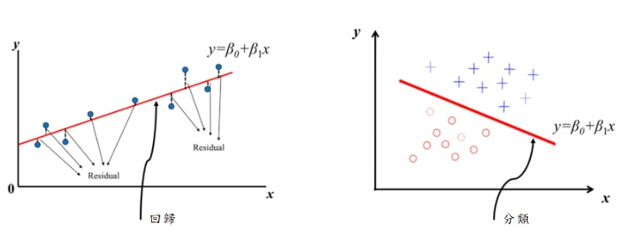
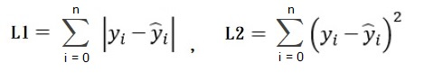
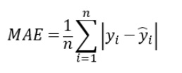
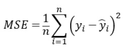
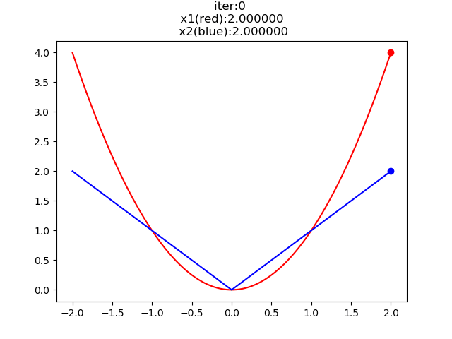
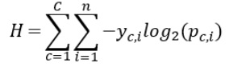
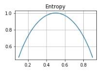
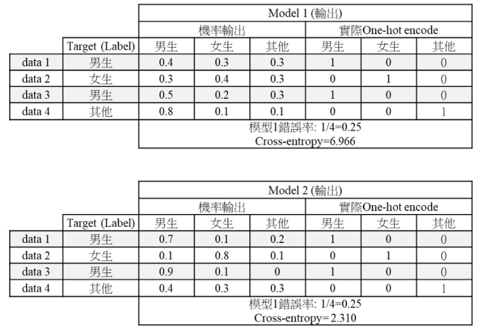

### Loss Function 介紹
- 原理 
機器學習中所有的算法都需要最大化或最小化一個函數，而損失函數我們一般希望他最小化，用來判斷模型的好壞，可分成兩類問題 (分類 與 回歸)
 

### Loss Function 分類
- 絕對值求和(L1)、平方和(L2) 
處理回歸問題，希望每個預測點都可以在線上，或者越靠近預測線，其差值稱為殘差(residual) 
L1-loss 對於異常值不明感，梯度變化相對小。 
L2-loss 收斂數度快  
 
- 均方誤差(Mean square error，MSE)、平均絕對值誤差(Mean absolute error，MAE) 
處理回歸問題，類似L1、L2，差別在於平均項 
MAE 屬於線性方程，微分後梯度是一個定值，當靠近解時，收斂快，不容易更新到最佳解。 
 
MSE 越遠離解梯度越大，越靠近解梯度越小，收斂慢。 
 
紅色代表MSE、 藍色代表MAE，可以看出以上的解釋[2]。
 
- 交叉熵(cross-entropy) 
 
處裡分類問題，訊息量的統計(量測不確定性)，先介紹Entropy，舉例 A玩遊戲很厲害，勝率0.9，失敗0.1，B不太厲害，勝率0.3，失敗0.7，C略懂遊戲，勝率一半一半 
Entropy H(A) = -0.9log(0.9) - 0.1log(0.1) = 0.4689 
Entropy H(B) = -0.3log(0.3) - 0.7log(0.7) = 0.8812 
Entropy H(C) = -0.5log(0.5) - 0.5log(0.5) = 1 
有此可知 C的不確定最大，完全猜不到結果，由下圖可知悅不確定Entropy越大。 
 
以下表歲然錯誤率都是0.25，但cross-entropy可以看出兩個model的好壞。  
 
模型一 
男生的cross-entropy: 
-(1 × log(0.4)+0 × log(0.3)+1 × log(0.5)+0 × log(0.8))=2.322 
 女生的cross-entropy: 
 -(0 × log(0.3)+1 × log(0.4)+0 × log(0.2)+0 × log(0.1))= 1.322 
 其他的cross-entropy: 
-(0 × log(0.4)+0 × log(0.3)+0 × log(0.3)+ 1 × log(0.1))= 3.322 
模型一的cross-entropy 
=男生的cross-entropy+女生的cross-entropy其他的cross-entropy 
=2.322+1.322+3.322= 6.966 
可以得知 cross-entropy越小，代表模型越好。 
 
##### Reference
- [1]https://zhuanlan.zhihu.com/p/48426076
- [2]https://medium.com/@chih.sheng.huang821/%E6%A9%9F%E5%99%A8-%E6%B7%B1%E5%BA%A6%E5%AD%B8%E7%BF%92-%E5%9F%BA%E7%A4%8E%E4%BB%8B%E7%B4%B9-%E6%90%8D%E5%A4%B1%E5%87%BD%E6%95%B8-loss-function-2dcac5ebb6cb